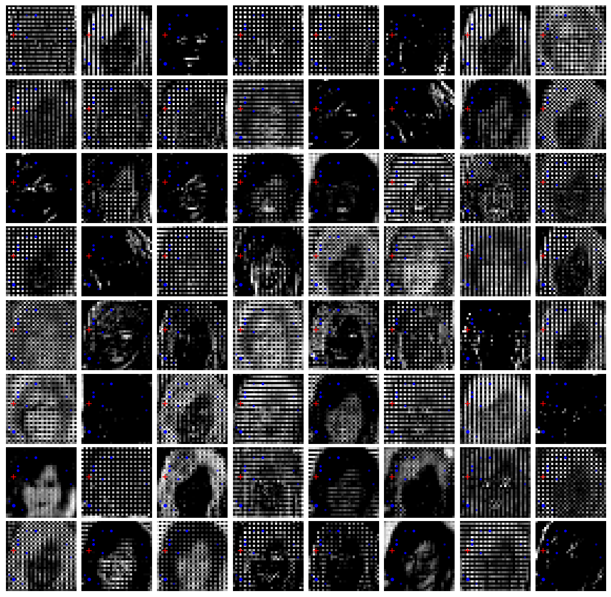
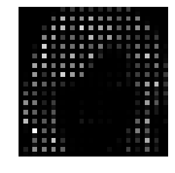
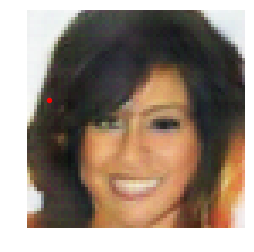
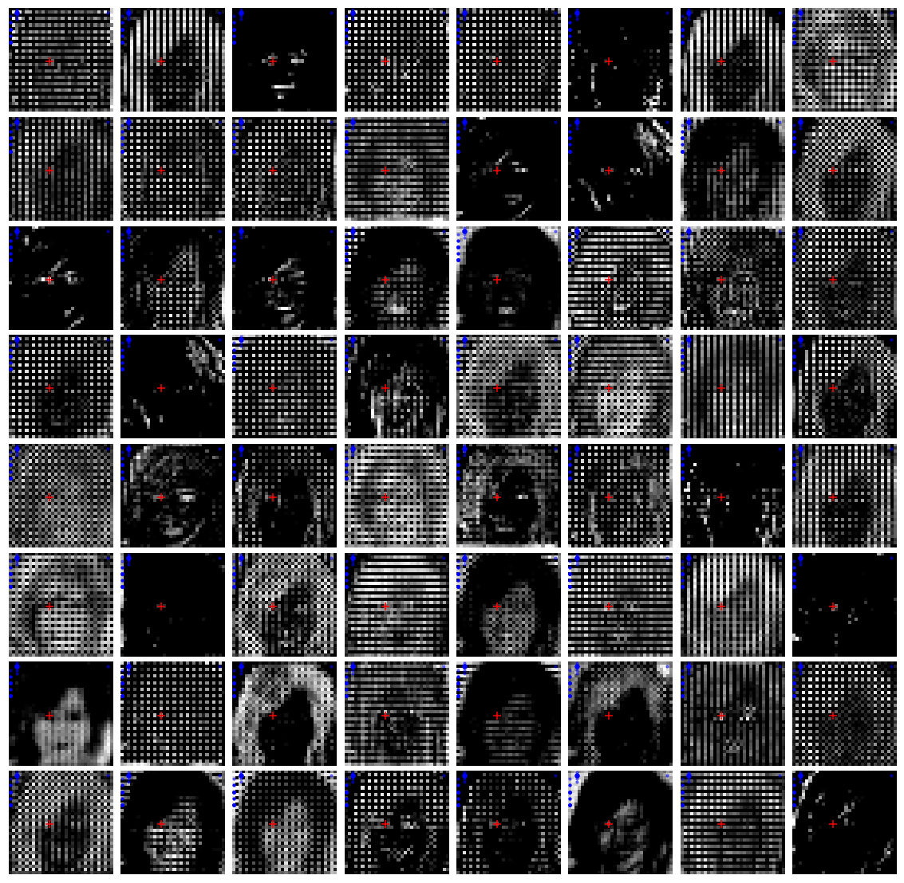
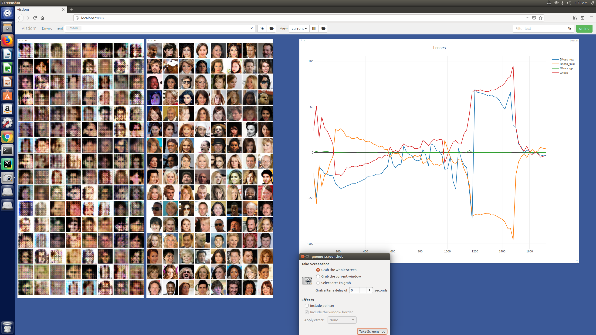

# Self-Attention Visualization for GAN

This is pytorch implementation of [Self-Attention GAN](https://arxiv.org/abs/1805.08318).  

Code was heavily borrowed from [heykeetae](https://github.com/heykeetae/Self-Attention-GAN)  

The main purpose of this project is to visualize attention map. As in [paper](https://arxiv.org/pdf/1706.03762.pdf), self-attention can be seen as query, key and value triple and for generating pixel in every location, all locations will be queried resulting in probability distribution over all locations. Probability can be seen as weights which sum to one. Using weights and corresponding values we can get a real number used to adjust the value of certain location a little bit, by doing so for all locations we finally influence all pixels.  

Here we only interested in weights, or probability which describes where and what level the model should pay attention to for per location. We specified one, and visualized the weights.  

## Example results
This is the feature maps(dim=64) taken from second last layer of generator. Red crossing stands for target location, and Blue dots are 10 locations that have greatest weights. The bigger, the greater weight they represent.



Here is one pixel on the hair and its attention map. The attention map(left) is the same one above.  
(pixel of red dot in the right image is related to, but not only to red crossing in the above)



### another result

Here is one location on the eye, with the same treating.



One might ask what does it mean when higher weights are assigned to certain location. In the original paper, the authors argued that self-attention helps network leverage complementary features in distant portions of the image(e.g. cat has 4 legs when generating cat image). In my experiment,  my observation is, for location on the hair, it seems to conceptually capture hair outline like a sketch; higher weights may tell the model to focus more on those locations which indicate structure information. 

However on the eye it seems failed to show meaningful results as I expected.(the color in the background didn't match pixel on the eye, which is black)  

## Prerequisites

* Linux or macOS
* Python3
* NVIDIA GPU + CUDA CuDNN

## Usage

**1. Clone the repository**

```bash
$ git clone https://github.com/houze-liu/Attention-Visualization-GAN.git
$ cd Attention-Visualization-GAN
```

**2. Put in dataset**

download [celebA](http://mmlab.ie.cuhk.edu.hk/projects/CelebA.html) and put it under `./dataset`, so it should be like `./dataset/celebA/IMAGES`

**3. Train**

``` bash
$ python main.py
```

After training, `visualize_attn.ipynb` should be able to load model.

## Recent update

training monitor through [visdom](https://github.com/facebookresearch/visdom)

```bash
$ pip intall visdom
```

and run it:

```bash
$ visdom
```

Open the url in your browser and it should be like this:




TODO:  

- [ ] change where self-attention was inserted; different layer may show different results.


